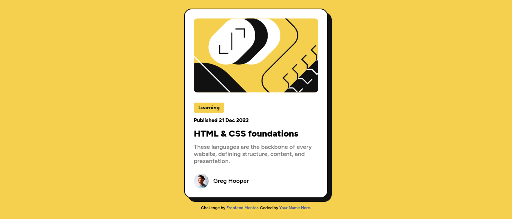

# Frontend Mentor - Blog preview card solution

This is a solution to the [Blog preview card challenge on Frontend Mentor](https://www.frontendmentor.io/challenges/blog-preview-card-ckPaj01IcS). Frontend Mentor challenges help you improve your coding skills by building realistic projects.

## Table of contents

- [Overview](#overview)
  - [The challenge](#the-challenge)
  - [Screenshot](#screenshot)
  - [Links](#links)
- [My process](#my-process)
  - [Built with](#built-with)
  - [What I learned](#what-i-learned)
  - [Continued development](#continued-development)
  - [Useful resources](#useful-resources)
- [Author](#author)
- [Acknowledgments](#acknowledgments)

**Note: Delete this note and update the table of contents based on what sections you keep.**

## Overview

### The challenge

Users should be able to:

- See hover and focus states for all interactive elements on the page

### Screenshot



### Links

- Solution URL: [frontendmentor challenge solution](https://www.frontendmentor.io/solutions/blog-preview-card-On2Ju3PGOD)
- Live Site URL: [github pages live site](https://coder-abdo.github.io/blog-preview-card/)

## My process

### Built with

- Semantic HTML5 markup
- CSS custom properties
- Flexbox
- CSS Grid
- CSS Media Queries Range Syntax
- CSS Containers
- CSS Layers

### What I learned

```html
<footer class="card-footer" role="contentinfo">
  
  <h4 class="author-name" aria-label="Author: Greg Hooper">Greg Hooper</h4>
</footer>
```

```css
@container (width < 37.5rem) {
    .card {
      max-width: 38.4rem;
    }
    .card-badge {
      font-size: 1.2rem;
    }
    .card-subtitle {
      font-size: 1.2rem;
    }
    .card-title {
      font-size: 2rem;
    }
    .card-description {
      font-size: 1.4rem;
    }
    .author-image {
      width: 3.2rem;
      height: 3.2rem;
    }
    .author-name {
      font-size: 1.4rem;
    }
  }
}

```

### Continued development

I will continue use the latest `CSS` features and techniques.

### Useful resources

- [Kevin Powell Youtube channel](https://www.youtube.com/watch?v=2rlWBZ17Wes&ab_channel=KevinPowell) - This video helped me for how to use `containers & media queries range syntax`. I really liked this pattern and will use it going forward.
- [Kevin Powell Youtube channel](https://www.youtube.com/watch?v=NDNRGW-_1EE&ab_channel=KevinPowell) - This is a youtube video which helped me understand `CSS Layers`. I'd recommend it to anyone still learning this concept.

## Author

- Website - [my portfolio](https://abdelmonaem-portfolio.vercel.app/)
- Frontend Mentor - [@coder-abdo](https://www.frontendmentor.io/profile/coder-abdo)
  -LinkedIn - [Abdelmonaem](https://www.linkedin.com/in/abdelmonaem-shahat/)
